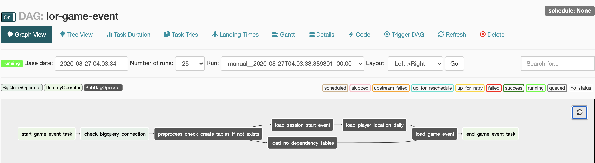

# CI/CD for data processing workflow
This repository contains source code for the guide on how to use Cloud Build, Bazel, Cloud Composer and Artifact Registry with Apt Repository to create a CI/CD pipeline for building, deployment and testing of a data processing workflow.

# Roles for the Tools
1. Github (as a Code Repository for Colloboration)
2. Github Actions(for Linting/Syntax Validation/Pre-commit hooks)
3. Cloud Build(as a CD tool)
4. Bazel(as an Artifact producer)
5. Artifact Registry(as an APT Repository)
6. Cloud Composer(as an Airflow DAG Scheduler)

The code is in two folders:

1. monorepo-data/etls -
evaluation/game-1/xxxxxxxxxx has Game Event code (sql scripts, dag workflow code).
The monorepo-data/build-utils folder contains shell scripts for the initial setup of the Google Cloud environment.
The etls/evaluation/game-1/game-event folder contains code that is developed over time, needs to be source controlled, and triggers automatic build and test processes. This folder contains the following subfolders:
2. monorepo-data/buid-utils -
This folder holds build scripts and environment setup scripts.

Please refer the below diagram for source code structure.
   

#The CI/CD pipeline
At a high level, the CI/CD pipeline consists of the following steps:

1. Developers cuts the branch, creates a feature branch, then commits the code, issues the PR
2. Trigger Github Actions which does linting, syntax validation for SQL
3. Successful Github Actions will merge into base branch triggering cloud build, Failed pre-commit will trigger notification
4. Cloud Build extracts the code from the Github branch
5. Cloud Build triggers Bazel Build using the Bazel builder container image.
6. Bazel packages the DAG files into a Debian Archive (DEB) file, having appropriate metadata containing branch name, version etc
7. Cloud Build uploads the DEB file to Cloud Storage Bucket(Needed due to requirement of Cloud Artifact Registry accepting only GCS source)
8. Cloud Build publishes to APT repository of Cloud Artifact Registry.
9. Cloud Build runs unit tests
10. Cloud Build explodes the DEB file, and extracts the DAG
11. Cloud Build deploys the workflow code to Cloud Composer(Airflow) DAG GCS bucket.
12. Airflow updates the DAG, and runs the Data Processing as per the DAG configuration.

The following diagram shows a detailed view of the CI/CD pipeline steps.

## The data-processing workflow

The instructions for how Cloud Composer runs the data-processing workflow are defined in a Directed Acyclic Graph (DAG) written in Python. In the DAG, all the steps of the data-processing workflow are defined together with the dependencies between them.

The Stage CI/CD pipeline automatically deploys the DAG definition from git Repository when a commit is merged to Master branch. This process ensures that Cloud Composer is always up to date with the latest workflow definition without needing any human intervention.

In the DAG definition for the test environment, an end-to-end test step is defined in addition to the data-processing workflow. The test step helps make sure that the data-processing workflow runs correctly.

The data-processing workflow is illustrated in the following diagram.

