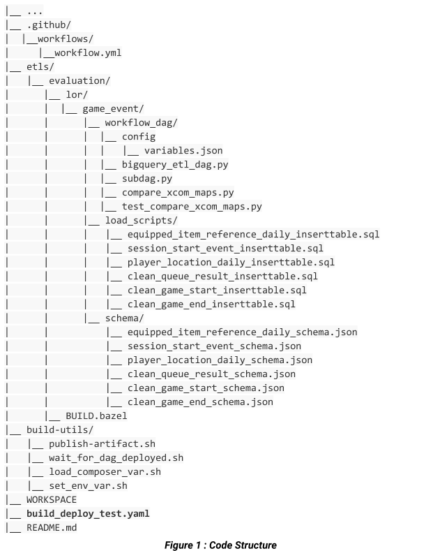
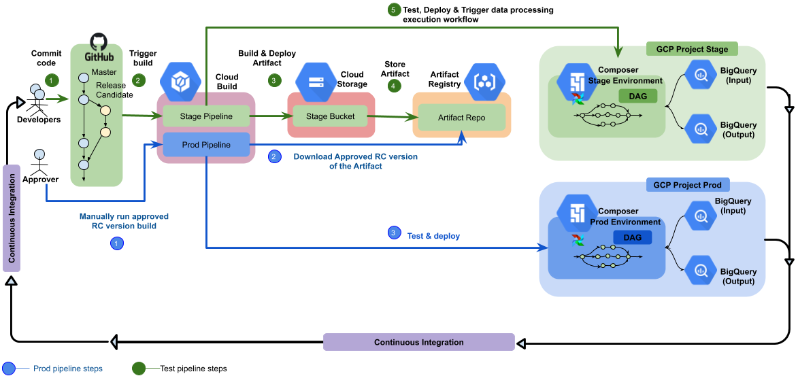
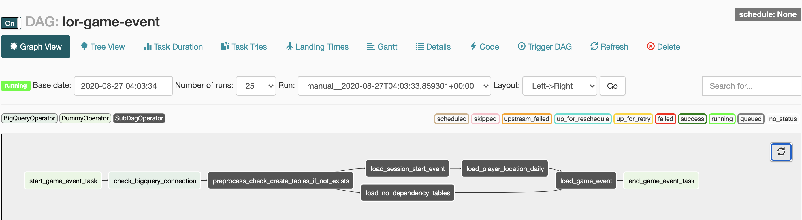

# CI/CD for data processing workflow
This repository contains source code for the guide on how to use Cloud Build, Bazel, Cloud Composer and Artifact Registry with Apt Repository to create a CI/CD pipeline for building, deployment and testing of a data processing workflow.

The code is in two folders:

1. monorepo-data/etls -
evaluation/lor/game_event has Game Event code (sql scripts, dag workflow code).
The monorepo-data/build-utils folder contains shell scripts for the initial setup of the Google Cloud environment.
The etls/evaluation/lor/game-event folder contains code that is developed over time, needs to be source controlled, and triggers automatic build and test processes. This folder contains the following subfolders:
2. monorepo-data/buid-utils -
This folder holds build scripts and environment setup scripts.

Please refer the below diagram for source code structure.
   

#The CI/CD pipeline
At a high level, the CI/CD pipeline consists of the following steps:

1. Cloud Build packages the lor game-event dag files into a Debian Archive (DEB) file using the Bazel builder. The Bazel builder is a container with Bazel installed in it. When a build step is configured to use the Bazel builder, Bazel runs the tasks.
1. Cloud Build uploads the DEB file to Cloud Storage and publishes to APT repository of Cloud Artifact Registry.
1. Cloud Build runs unit tests on the data-processing workflow code and deploys the workflow code to Cloud Composer.
Cloud Composer picks up the DEB file and runs the data-processing job on Dataflow.

The following diagram shows a detailed view of the CI/CD pipeline steps.

## The data-processing workflow

The instructions for how Cloud Composer runs the data-processing workflow are defined in a Directed Acyclic Graph (DAG) written in Python. In the DAG, all the steps of the data-processing workflow are defined together with the dependencies between them.

The Stage CI/CD pipeline automatically deploys the DAG definition from git Repository when a commit is merged to Master branch. This process ensures that Cloud Composer is always up to date with the latest workflow definition without needing any human intervention.

In the DAG definition for the test environment, an end-to-end test step is defined in addition to the data-processing workflow. The test step helps make sure that the data-processing workflow runs correctly.

The data-processing workflow is illustrated in the following diagram.

